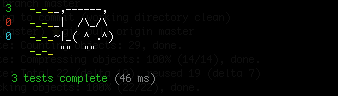

# API Testing with Node.js

---

> Testing an API with Node.js is dead simple. You can quickly write tests for any API, regardless of its language.

### Hackers Don't Test
I don't like writing tests. Just ask any of my coding teammates. I spent too many years slapping together quick protoypes that were just for proof of concept and didn't need to be maintained. I think of testing like financial accounting; I know it's vital to keep operations running smoothly, but I much prefer if somebody else handles it.

I'm getting better though, and it's paying off. You've probably already read about the reasons you should write tests. If you're still not convinced, consider this: it's quickly becoming table stakes for most modern web development projects, much like knowing how to use [Github](http://github.com). If you want to contribute to open source projects, or make it past your first interview, you've gotta write tests.

### Unit, Integration, Functional, and Acceptance
I'm going to skip the [philosophy](http://www.agitar.com/downloads/TheWayOfTestivus.pdf) and finer points. Read this answer for a great explanation of the [different types of tests](http://stackoverflow.com/a/4904533). On the most granular level we have unit tests. On the other end of the spectrum we have browser-testing tools like [PhantomJS](http://phantomjs.org/) or SaaS options like [BrowserStack](http://browserstack.com) and [Browserling](http://browserling.com). We're going to be closer to that high level testing, but since this is purely an API, we don't need a browser.

### Our Example API
Let's take a look at our example API, which is a protected pretend blog. In order to show off some of the testing options, this API:

- requires Basic Auth
- requires an API key be passed in as a custom header
- always returns JSON
- sends proper status codes with errors

### Mocha, Chai, and SuperTest
If you've spent 30 minutes tinkering with Node.js, there's a really good chance you've seen the work of [TJ Holowaychuck](https://github.com/visionmedia) and his army of ferrets. His [Mocha testing framework](http://mochajs.org/) is popular and we'll be using it as a base. Fewer people have seen his [SuperTest](https://github.com/visionmedia/supertest) library, which adds some really nice shortcuts specifically for testing HTTP calls. Finally, we're including [Chai](http://chaijs.com/) just to round out the syntax goodness.

    var should = require('chai').should(),
        supertest = require('supertest'),
        api = supertest('http://localhost:5000');

Note that we're passing in the base URL of our API. As a sidenote, if you're writing your API in [Express](http://expressjs.com), you can use SuperTest to hook write into your application without actually running it as a server.

### Test Already!
Install Mocha (`npm install -g mocha`) and check out the [getting started section](http://mochajs.org/#getting-started). To summarize, you can group little tests (assertions) within `it()` functions, and then group those into higher level groups within `describe` functions. How many things you test in each `it` and how you group those into `describe` blocks is mostly a matter of style and preference. You'll also evenutally end up using the `before` and `beforeEach` features, but our sample test doesn't need them.

Let's start with authentication. We want to make sure this API returns proper errors if somebody doesn't get past our two authentication checks:

[See the gist](https://gist.github.com/jedwood/5311084)

Don't let the syntax on lines 3 and 10 throw you- we're just giving the tests names that will make sense to us when we view our reports. You can put pretty much anything in there. In both tests (the `it` calls), we make a `get` call to `/blog`.

 In our first test, we use `set` to add our custom header with a correct value, but then we set put some bad credentials in `auth` (which creates the BasicAuth header). We're expecting a proper `401` status.

In our second test, we set the correct BasicAuth credentials but intentionally omit the `x-api-key`. We're again expecting a `401` status.

### Run Nyan Run!
We're almost ready to run these tests. Let's follow TJ's advice:

> Be kind and don't make developers hunt around
> in your docs to figure out how to run the tests,
> add a `make test` target to your `Makefile`

So here's what that looks like:

    TESTS = test/*.js
    test:
      mocha --timeout 5000 --reporter nyan $(TESTS)

    .PHONY: test

*[UPDATE TWO YEARS LATER]* It's now pretty common to instead include your test command as part of the `scripts` block in the `package.json` file. Then tests can be run with `npm test`. 

The two flags in there are increasing the default timeout of 2000ms and telling Mocha to use the excellent [nyan reporter](https://vimeo.com/44180900).

Finally, we jump over to our terminal and run `make test`. Here's what we get:

Uh oh. Looks like the API is returning a message that looks like an error, but the status is `200`. Let's fix that in the API code by changing this:

`res.send({error: "Bad or missing app identification header"});`

to this:

`res.status(401).send({error: "Bad or missing app identification header"});`

### Expect More
Like all good developers, I'm going to be confident that I've fixed it and move on before re-running the report. Let's add another test:

[See the gist](https://gist.github.com/jedwood/5311429)

This one has an "end" callback because we're going to be inspecting the actual results of the response body. We send correct authentication and then check four aspects of the result:

- line 7 checks for 200 status
- line 8 makes sure the format is JSON
- line 11 is a chain that checks for a `posts` property, and also makes sure it's an `array`.

It's Chai that's giving us that handy.way.of.checking.things.

Run the tests again...wait 46ms...and...

Happy Nyan!

### Hackers Don't Mock
Another common component of testing is the notion of using "mock" objects and/or a sandboxed testing database. What I like about the setup we've covered here is that it doesn't care. We can run our target server in production or dev or testing mode depending on our purpose and risk aversion without changing our tests. Finer-grained unit testing and mock objects certainly have their place, but a lot can go wrong in between those small abstracted pieces and your full production environment. High-level acceptance tests like the ones we've built here can broadly cover the end user touchpoints. If an error crops up, you'll know where to start digging.

_Now go test all the things!_
